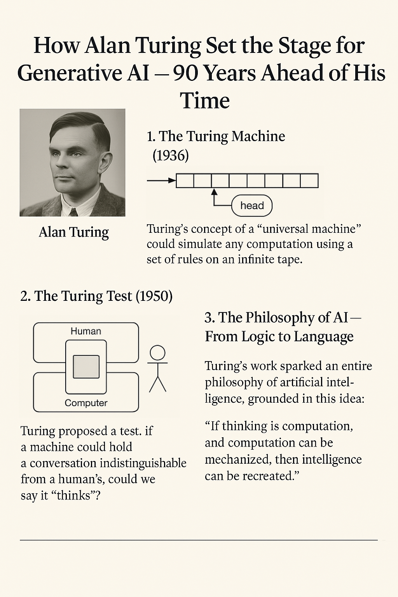

# Alan Turing: The Man Who Made AI Thinkable

Alan Turing was a brilliant mathematician, logician, and cryptographer. He’s often referred to as the father of modern computing and artificial intelligence.

## How Alan Turing’s Vision Shaped Modern AI — and Laid the Groundwork for Generative Intelligence

In 1936, long before the first computers existed, Alan Turing imagined a machine that could follow a set of instructions to solve any problem that could be described algorithmically. He called it the universal machine — what we now call a Turing machine.

This theoretical idea would become the blueprint for every modern computer.

### 1. The Turing Machine: Universal Logic
Turing’s machine wasn’t mechanical — it was a thought experiment.  
It had an infinite tape, a read/write head, and a set of rules for symbol manipulation. That’s it.

But what it proved was revolutionary: any logical problem could be solved by this machine, given enough time and memory.

This concept laid the foundation for all algorithmic computing — from search engines to deep learning models.

### 2. The Turing Test: Can Machines Think?
In 1950, Turing shifted the conversation from what machines can do to what they can imitate.

He proposed the Imitation Game — what we now call the Turing Test:  
If a machine can converse so naturally that a human can't tell it's not another person, does it matter whether it "thinks"?

This idea sparked the field of Artificial Intelligence and framed machine intelligence not as a mystery, but as a measurable behavior.

### 3. The Philosophy of AI and the Birth of Generative Intelligence
Turing’s philosophical leap was simple but profound:

> If thinking is computation, and computation can be mechanized, then intelligence itself can be reproduced.

This idea sparked debates in cognitive science, AI ethics, and machine consciousness — and it continues today in the era of Generative AI.

Today’s tools — like GPT, DALL·E, or autonomous agents — are built on the belief that language, vision, and even reasoning can be learned, modeled, and mimicked by machines.  
They create. They adapt. They improve.  
Exactly the kind of machine Turing imagined — 90 years ago.

## Conclusion: Why Turing Still Matters
Turing didn’t just lay the groundwork for modern computing.  
He opened the door to a future where intelligence is no longer just human.

His ideas are embedded in every AI model, every algorithm, every question we ask about what machines can do — and what it means for us.

We are not just building smarter machines. We are finally catching up to Turing’s imagination.

